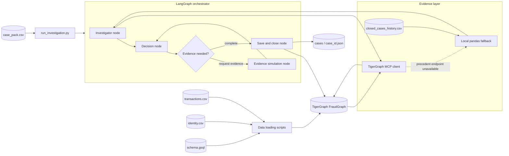
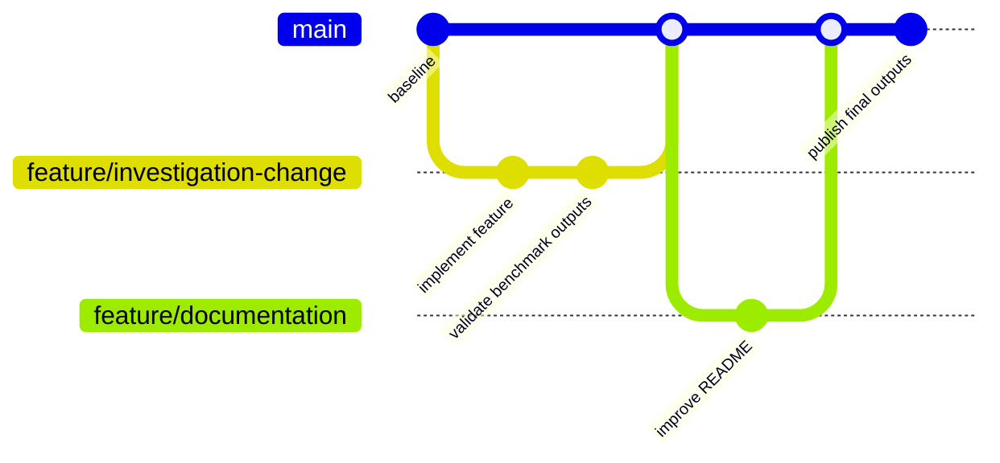

# TigerGraph Fraud Investigation Agent

An agentic fraud investigation system built for the TigerGraph Hackathon. It
combines graph evidence, local case memory, and Google Gemini reasoning to
investigate 20 benchmark cases and produce auditable recommendations.

## At A Glance

The system answers a practical question: **What happened, how confident are we,
and what should the bank do next?**

- It compares suspicious transactions with the cardholder's history.
- It looks for related devices, regions, transactions, and closed cases.
- It distinguishes fraud, legitimate activity, and cases that need human review.
- It can request simulated customer evidence and show how the recommendation changes.
- It writes the investigation result back to TigerGraph and saves a readable JSON answer file.

## Demo Video

[Google Drive demo folder](https://drive.google.com/drive/folders/1JQ2Rokt4nrLOKi20YA5Ro-9a9aopoS0u?usp=share_link)

## Accessible Design

Fraud investigation is often reviewed by people who should not have to read
Python or decode raw machine output. This project keeps the underlying JSON and
graph evidence for automation and auditability, while also producing
human-readable context for every case.

The output explains the finding in plain language, identifies the evidence that
supports it, shows relevant historical case IDs, and states the recommended
action and approval route. A non-technical reviewer can therefore understand
the decision without opening the source code or reconstructing the reasoning
from raw database responses.

### What A Stakeholder Sees

| Output | Plain-language meaning |
|---|---|
| `summary` | A short explanation of what the investigation found |
| `evidence` | The claims, sources, and IDs supporting the conclusion |
| `similar_prior_cases` | Closed cases that provide historical context |
| `evidence_requests` | What additional information was requested or assumed |
| `next_best_actions.initial` | The first recommendation before more evidence |
| `next_best_actions.final` | The recommendation after evidence is considered |
| `next_best_actions.what_changed` | Why the recommendation stayed the same or changed |
| `sar` | Whether a suspicious activity report is appropriate |

### A Quick Audit Path

1. Read `summary` to understand the case in ordinary language.
2. Check `evidence` and `similar_prior_cases` to verify the supporting context.
3. Compare the `initial` and `final` actions to see how new evidence affected the decision.
4. Use the graph IDs and JSON fields to trace the result back to TigerGraph when deeper review is needed.

## System Architecture

The following flow shows how source data becomes an investigation result. The
TigerGraph MCP client is the primary graph evidence path. The local pandas
fallback keeps closed-case memory available when the MCP precedent endpoint is
unavailable.



### Component Responsibilities

- **Inputs:** case alerts, transaction history, identity data, graph schema, and closed-case history.
- **LangGraph orchestrator:** controls investigation, decision-making, evidence evolution, and graph write-back.
- **TigerGraph MCP client:** retrieves transaction and graph relationship evidence through standard MCP tools.
- **Local fallback layer:** matches the current card or customer against `closed_cases_history.csv` with pandas.
- **JSON generation:** writes one structured, stakeholder-readable answer for each case.

## Development Workflow

Feature work is developed in isolation, validated against the benchmark, merged
into `main`, and then followed by case regeneration when output behavior changes.



Recommended workflow:

- Create a focused feature branch.
- Make the smallest behavior or documentation change needed.
- Run syntax checks and targeted smoke tests.
- Delete stale generated outputs when behavior changes.
- Regenerate and validate all 20 case files.
- Review the staged diff before merging or pushing to `main`.

## Project Layout

- `data/`: benchmark inputs, dataset documentation, and closed-case history
- `schema/`: TigerGraph GSQL schema definitions
- `scripts/`: connection, schema, query, authentication, and data-loading utilities
- `agent/`: LangGraph state machine, prompts, MCP tools, fallback tools, and state definitions
- `cases/`: generated JSON answer files for the 20 benchmark cases
- `run_investigation.py`: batch runner for the benchmark case pack

## Setup

Create and activate a virtual environment:

```bash
python3 -m venv venv
source venv/bin/activate
```

Install the project dependencies:

```bash
pip install -r requirements.txt
```

Copy `.env.example` to `.env` and fill in the TigerGraph and model credentials:

```bash
cp .env.example .env
```

The active environment should provide `TG_HOST`, `TG_GRAPH`, `TG_USERNAME`,
`TG_PASSWORD`, `GEMINI_API_KEY`, and `TIGERGRAPH_MCP_COMMAND` or
`TIGERGRAPH_MCP_URL`.

Keep credentials in `.env`. The file is ignored by Git and must never be
committed or hardcoded into Python source files.

Raw CSV files are intentionally excluded from Git because the transaction file
is large. Place the benchmark data files in `data/` before loading or running
the agent.

## Execution

Run the complete benchmark batch from the project root:

```bash
source venv/bin/activate
python run_investigation.py
```

The runner processes `data/case_pack.csv`, skips case outputs that already
exist, and writes one JSON result per case to `cases/<case_id>.json`.

To run one case while iterating:

```bash
CASE_ID=HHG-001 python -W ignore run_investigation.py
```

## Verification

The final output set contains 20 JSON files. Each output includes the case
assessment, structured graph evidence, historical case memory, SAR fields,
initial and final action recommendations, approval routes, tool-call metadata,
latency, and graph write-back identifiers.

Useful checks include:

```bash
python -m compileall -q agent run_investigation.py
git diff --check
```
